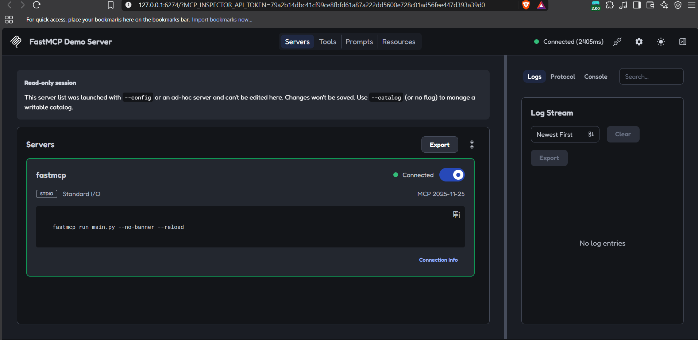
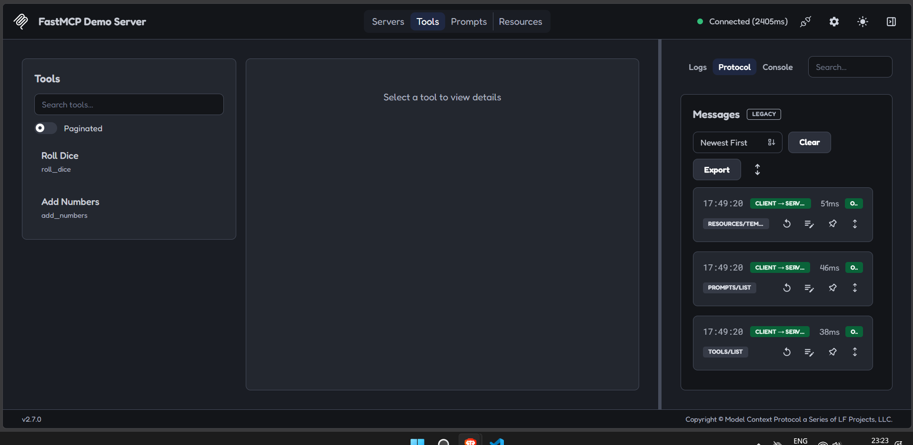
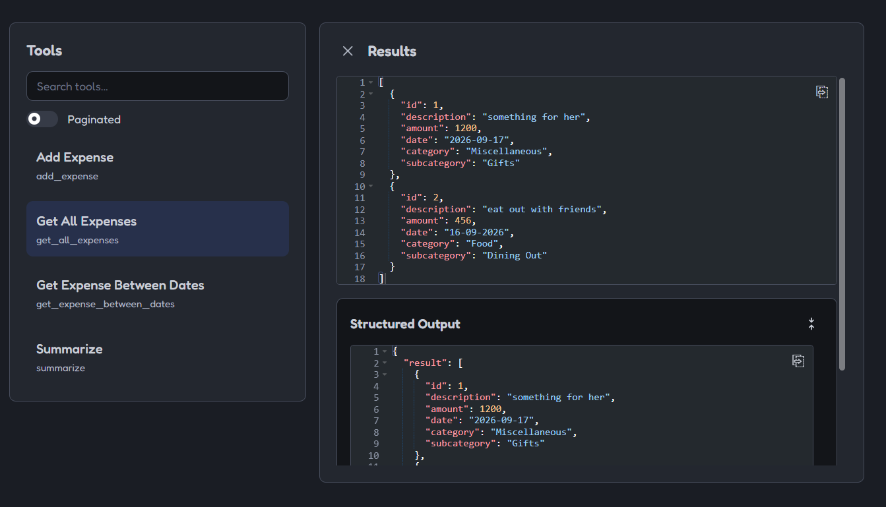
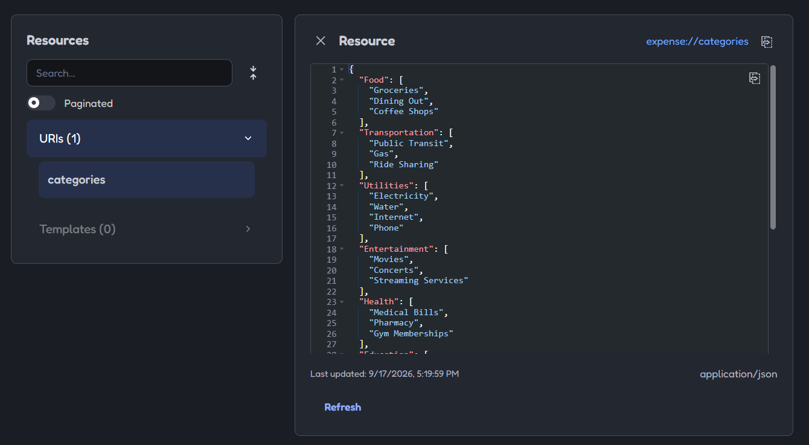
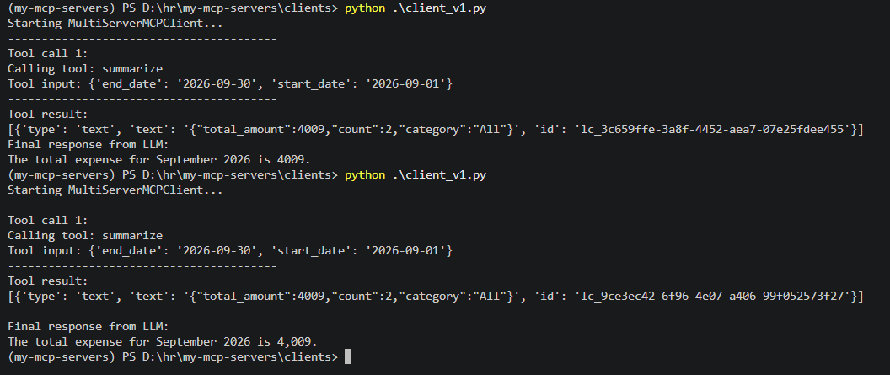

### Command to Run the MCP inspector
```bash
uv run fastmcp dev inspector main.py
```
- Inspector is like a POSTMAN to MCP server (or like SWAGGER UI)

- Tools


### Expense Tracker MCP
- Tool Call

- Resource/Get

- Client Local MCP Tool Call

### Remote MCP
- Deploy with `fastmcp.cloud` by connecting your GitHub repo
- Expense-tracking-mcp deployed on [URL](https://expense-tracking-mcp.fastmcp.app/mcp)
    1. However the mcp is better to use locally, because
    2. No user authentication
    3. No user level separation of expenses


### Local Setup & Installation

#### 1. Prerequisites: Install `uv`

`uv` is a fast Python package installer and virtual environment manager.

* **Linux / macOS:**
  ```bash
  curl -LsSf [https://astral.sh/uv/install.sh](https://astral.sh/uv/install.sh) | sh
  ```

* **Windows (PowerShell):**
  ```powershell
  powershell -executionpolicy bypass -c "irm [https://astral.sh/uv/install.ps1](https://astral.sh/uv/install.ps1) | iex"
  ```

---

#### 2. Environment Configuration

1. Navigate to the project directory:
```bash
cd local-mcp/expense-tracking-mcp
```
2. Create a `.env` file in the project root:
```env
DB_NAME=expenses.db
```
---

#### 3. Setup Virtual Environment & Dependencies

1. **Create and activate a virtual environment:**
* **Linux / macOS:**
```bash
uv venv
source .venv/bin/activate
```

* **Windows (CMD / PowerShell):**
```cmd
uv venv
.venv\Scripts\activate
```
2. **Install project dependencies:**
```bash
uv pip install -r requirements.txt
```

---

#### 4. Run the Server with MCP Inspector

Launch the server in dev mode using FastMCP's built-in developer UI; where you can list tools. call tools, and get resources:

```bash
uv run fastmcp dev inspector main.py
```
---

#### 5. Run the MCP Server

Launch the MCP server in production mode to communicate directly with an AI client (like Claude Desktop, Cursor, or an API client):

```bash
fastmcp run main.py
```